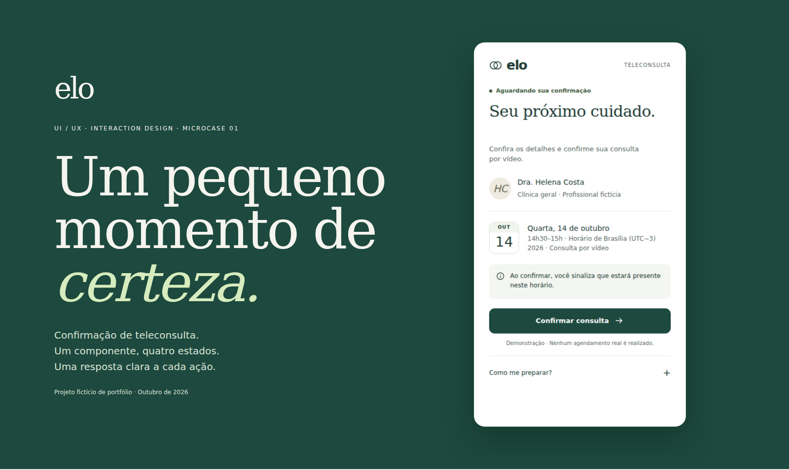

# elo — Um pequeno momento de certeza

Microcase fictício de UI/UX e Interaction Design: confirmação de presença em uma consulta de telemedicina. Versão 1.0, 8 de outubro de 2026.

## Experimentar

Abra **index.html** no navegador. Funciona offline e não exige instalação. Abra **case.html** para a apresentação visual. Opcionalmente, rode `python -m http.server 8000` dentro desta pasta.

1. Clique em **Confirmar consulta** para acompanhar o processamento e o sucesso.
2. No controle externo **Ao confirmar**, selecione **Falhar uma vez**. A primeira tentativa falha; **Tentar novamente** conclui com sucesso.
3. **Demorar e falhar** simula uma espera de 6,5 segundos, com interrupção disponível e mensagem de timeout.
4. Os quatro botões de estado são inspeções de design. **Processando** nesse painel é uma visualização persistente, sem requisição; a interação real começa no botão do componente.
5. No sucesso, **Salvar no calendário** gera um arquivo `.ics` de demonstração com horário correto em UTC.

**Nenhuma consulta real, comunicação, envio de email ou serviço médico é realizado.** Dados, marca e profissional são fictícios. O calendário é real como arquivo, mas representa um evento fictício. O estado não persiste após recarregar.

## Organização

- `index.html`: componente funcional, estilos e máquina de estados, sem dependências.
- `case.html`: apresentação visual com cinco módulos.
- `assets/`: capa, pranchas de Behance, quatro estados, versão mobile e GIF da interação.
- `docs/BEHANCE.md`: texto final e ordem de publicação.
- `docs/INTERACTION-SPEC.md`: regras, estados, mensagens e acessibilidade.
- `docs/PROVENANCE.md`: referência fixada e separação das skills.
- `docs/VALIDATION.md`: verificações técnicas realizadas e limites.
- `tests/verify.cjs`: verificação funcional e captura de assets com Playwright.

Projeto isolado em `projects/elo-telemedicina/` e na branch `microcase/elo-telemedicina` de `LTraina0/design-skills`. Nenhum arquivo original de skill foi modificado ou copiado para este projeto. A referência é ligada por URL e commit, sem duplicação de regras.

## Escopo e autoria

Um componente, uma ação, quatro estados. Cadastro, agenda completa, pagamentos, reagendamento, autenticação e sala de vídeo ficam fora do escopo. Direção de design e curadoria: Lucas Traina Finotti. Implementação e documentação assistidas por IA. A execução desta versão foi assistida por Codex; a revisão de publicação por Lucas permanece recomendada.

Não houve pesquisa com pacientes ou validação de usabilidade. O resultado demonstrado é um artefato executável e verificado tecnicamente, não um impacto clínico ou comercial.
