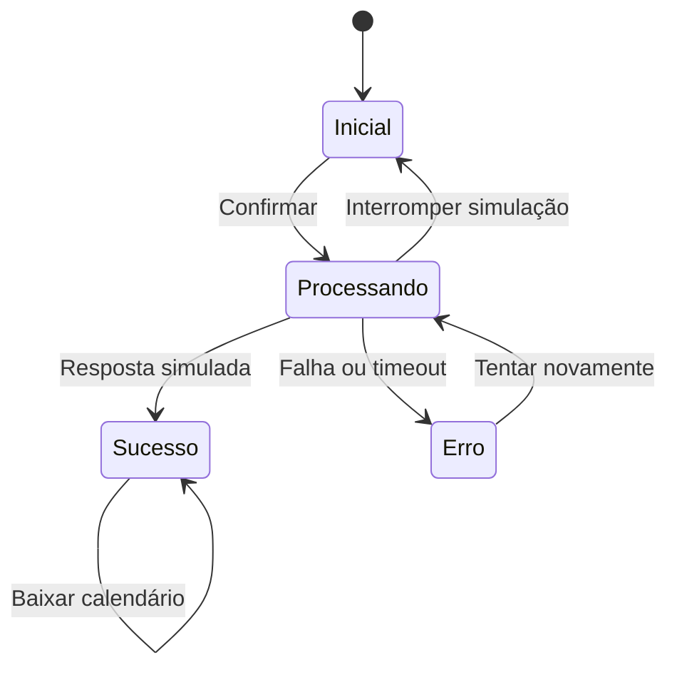

# Especificação — Confirmar presença em teleconsulta

Versão 1.0 · 08/10/2026 · Microcase elo

## Objetivo e contexto

Permitir revisar uma consulta já definida e confirmar presença com resposta clara. Interface transitória: uma tarefa breve, uma ação principal e contexto estável. A hipótese é que distinguir espera, sucesso e falha facilita entender o resultado. Não foi testada com pacientes.

## Trigger

Botão nativo **Confirmar consulta**, acionado por mouse, toque, Enter ou Espaço. Os dados de profissional, data, horário, duração e fuso ficam visíveis antes da ação. Hover escurece o verde; active reduz escala a 98,5%; foco tem contorno de 3 px e offset de 4 px. O alvo primário mede 48 px de altura.

## Rules

1. Inicial e erro podem iniciar uma tentativa.
2. Feedback de processamento aparece imediatamente. O mesmo botão é preservado no DOM para manter foco.
3. `aria-disabled=true` informa indisponibilidade durante processamento; o guard da máquina impede outra tentativa mesmo com Enter, Espaço ou clique repetido. O botão continua no percurso de teclado para explicar a espera.
4. Uma resposta simulada após 1,6 s conclui com sucesso ou falha. Este tempo serve para demonstrar o estado; não é uma meta de latência do produto.
5. No cenário **Falhar uma vez**, a primeira tentativa falha e a segunda tem sucesso. Não há retentativa automática.
6. No cenário **Demorar e falhar**, a espera termina em 6,5 s. Não há porcentagem inventada, porque não há progresso mensurável.
7. **Interromper simulação** limpa o timer, invalida sua geração e retorna ao inicial; o foco volta ao botão principal. É uma operação local. Cancelar uma confirmação real exigiria um contrato com servidor; não se promete essa capacidade.
8. Trocar cenário ou visualizar outro estado também invalida a tentativa pendente. O resultado antigo não pode sobrescrever o novo estado.
9. Sucesso permanece até reset no painel externo ou recarga. O botão passa a gerar um `.ics`, sem reenviar confirmação.
10. Recarregar ou sair perde o estado local. Nada é salvo ou enviado. Produção exigiria estado autoritativo, idempotência e reconciliação de respostas ambíguas.

## Feedback e inventário de estados

| Estado | Status / título | Mensagem | Ação |
|---|---|---|---|
| Inicial | Aguardando sua confirmação / Seu próximo cuidado. | Ao confirmar, você sinaliza que estará presente neste horário. | Confirmar consulta |
| Processando | Confirmando sua presença / Só um instante. | Aguarde a resposta antes de tentar novamente. | Confirmando… (indisponível); Interromper simulação |
| Sucesso | Presença confirmada / Tudo certo para o encontro. | Seu próximo passo: guardar o horário e se preparar para a consulta. | Salvar no calendário |
| Erro de conexão | Confirmação não concluída / Vamos tentar de novo? | A conexão simulada falhou. Tente novamente para confirmar sua presença. | Tentar novamente |
| Erro por timeout | Mesma categoria de erro | O tempo de espera terminou sem confirmação. Os detalhes continuam aqui; você pode tentar novamente. | Tentar novamente |

O timeout é uma variante do estado de erro. Em um serviço real, timeout pode ocorrer depois do processamento no servidor: consultar o status antes de repetir e usar chave de idempotência. O protótipo não tem servidor e não inventa confirmação.

Os dados permanecem visíveis. Sucesso e erro têm texto, ícone e tratamento de cor; não dependem só da cor. Informações para preparo são um `details/summary` nativo, disponível em todos os estados. Não há sound, vibração, modal ou confete.

## Loops e modes

Retentativa apenas por ação da pessoa, sem limite artificial no protótipo. Sem polling, contagem regressiva, expiração ou redirecionamento automático. Download do calendário pode ser repetido. Os seletores externos são modos de demonstração claramente identificados, não parte do componente de atendimento. Visualizar **Processando** no painel o mantém estático para inspeção; **Confirmar consulta** executa o fluxo temporizado.

## Máquina de estados

Reset externo retorna ao inicial a partir de qualquer estado. Inspeção externa pode mostrar qualquer um dos quatro estados, invalidando o timer.

## Motion e tokens

| Propriedade | Valor | Propósito |
|---|---|---|
| Feedback de botão | 100 ms | Hover e pressão |
| Entrada da mensagem | 200 ms, `cubic-bezier(.2,0,0,1)` | Sinalizar mudança; opacity + deslocamento de 3 px |
| Spinner | 850 ms linear | Indicar espera indeterminada, não progresso |
| Movimento reduzido | Sem animation, transition ou escala | Feedback por texto e mudança instantânea |
| Ação / marca | `#1d493e` | Hierarquia da ação |
| Texto | `#203b34` | Legibilidade |
| Texto secundário | `#596861` | Detalhes e apoio |
| Fundo | `#f5f4ef` | Ambiente editorial |
| Palco | `#e5efdf` | Destacar o componente |
| Erro | `#963d2f` / `#fff0eb` | Diferenciação sem depender só de cor |

Fontes do sistema (Georgia e Arial) permitem execução offline. A proporção de linhas pode variar entre sistemas; exports fixam a apresentação produzida.

## Acessibilidade

Idioma `pt-BR`, hierarquia de headings, botões e select nativos. Ordem de leitura acompanha a ordem visual. Mensagens rotineiras em região `role=status` com `aria-live=polite`; falhas em região `role=alert`. Regiões existem antes da atualização. A região viva fica fora do conteúdo visual duplicado e não depende do foco. `aria-busy` comunica processamento no componente. Foco só é movido ao interromper, pois o botão de interrupção desaparece; as demais transições preservam o elemento focado. Não há focus trap ou auto-scroll. Movimento reduzido desativa até o spinner, preservando “Confirmando…”. Botões do painel usam `aria-pressed`; alvos têm altura mínima de 44 px. Links de texto usam contexto e espaçamento.

Verificação automatizada não equivale a conformidade WCAG integral. Falta avaliação humana com leitor de tela, zoom e participantes reais. Referências normativas consultadas: [WCAG 2.2 — Status Messages](https://www.w3.org/WAI/WCAG22/Understanding/status-messages.html) e [Target Size Minimum](https://www.w3.org/WAI/WCAG22/Understanding/target-size-minimum.html). O critério AA de tamanho é 24 CSS px, com exceções; 44 px aqui é uma escolha de projeto mais generosa.

## Contrato de produção (fora desta entrega)

Dados reais e disponibilidade viriam de API autenticada. Status autoritativo, uma chave de idempotência por confirmação, consulta de status após timeout e verificações de horário/concorrência seriam necessários. Privacidade, segurança, integração de vídeo e mensagens só poderiam ser comunicadas depois de implementadas. Este microcase não faz tais promessas.
